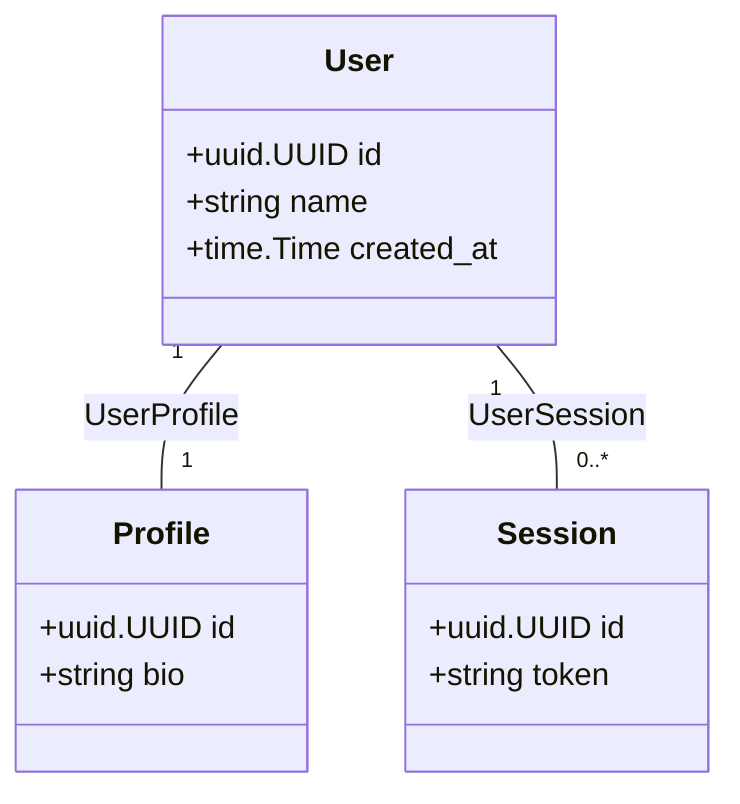

# fournf

An [Ent](https://entgo.io) extension that enforces **fourth normal form (4NF)**: all relationships must go through explicit join table schemas. No foreign key columns on entity tables.

Because it knows which schemas are join tables, it can also draw the schema as a domain diagram, collapsing each join back into a plain association. See [Class diagram](#class-diagram).

## Install

```sh
go get github.com/blobmasterbrian/fournf
```

## Usage

### 1. Wire the extension into `entc.go`

```go
//go:build ignore

package main

import (
    "log"

    "entgo.io/ent/entc"
    "entgo.io/ent/entc/gen"
    "github.com/blobmasterbrian/fournf"
)

func main() {
    ext, err := fournf.NewExtension()
    if err != nil {
        log.Fatalf("creating fournf extension: %v", err)
    }
    err = entc.Generate("./schema",
        &gen.Config{},
        entc.Extensions(ext),
    )
    if err != nil {
        log.Fatalf("running ent codegen: %v", err)
    }
}
```

`go generate` will now fail if any schema violates 4NF.

### 2. Define entity schemas and join table schemas

Entity schemas define your domain models. Join table schemas wire relationships
between them and are annotated with `fournf.JoinTable()`.

```go
// schema/species.go
package schema

type Species struct { ent.Schema }

func (Species) Fields() []ent.Field {
    return []ent.Field{
        field.String("name"),
    }
}

func (Species) Edges() []ent.Edge {
    return []ent.Edge{
        edge.From("habitats", Habitat.Type).
            Ref("species"),
    }
}
```

```go
// schema/habitat.go
package schema

type Habitat struct { ent.Schema }

func (Habitat) Fields() []ent.Field {
    return []ent.Field{
        field.String("name"), // e.g. "Rainforest", "Tundra"
    }
}

func (Habitat) Edges() []ent.Edge {
    return []ent.Edge{
        edge.From("species", Species.Type).
            Ref("habitats"),
    }
}
```

```go
// schema/species_habitat.go — join table
package schema

import "github.com/blobmasterbrian/fournf"

type SpeciesHabitat struct { ent.Schema }

func (SpeciesHabitat) Annotations() []schema.Annotation {
    return []schema.Annotation{
        fournf.JoinTable(),
    }
}

func (SpeciesHabitat) Fields() []ent.Field {
    return []ent.Field{
        field.Int("species_id"),
        field.Int("habitat_id"),
    }
}

func (SpeciesHabitat) Edges() []ent.Edge {
    return []ent.Edge{
        edge.To("species", Species.Type).
            Unique().
            Required().
            Field("species_id"),
        edge.To("habitat", Habitat.Type).
            Unique().
            Required().
            Field("habitat_id"),
    }
}
```

### What gets flagged

**Foreign keys on entity tables.** If an entity schema places a foreign key
directly on its own table via `.Field()`, code generation will fail:

```go
// schema/species.go — BAD: foreign key on an entity table
package schema

type Species struct { ent.Schema }

func (Species) Fields() []ent.Field {
    return []ent.Field{
        field.String("name"),
        field.Int("habitat_id"), // foreign key lives on the entity table
    }
}

func (Species) Edges() []ent.Edge {
    return []ent.Edge{
        edge.To("habitat", Habitat.Type).
            Unique().
            Field("habitat_id"), // this triggers the violation
    }
}
```

```
4NF violation: entity "Species" has edge "habitat" with .Field("habitat_id");
move this foreign key to a join table schema annotated with fournf.JoinTable()
```

**Non-foreign-key fields on join tables.** Join tables may only contain foreign
key fields. Adding extra columns defeats the purpose of the join table:

```go
// schema/species_habitat.go — BAD: extra field on a join table
package schema

type SpeciesHabitat struct { ent.Schema }

func (SpeciesHabitat) Annotations() []schema.Annotation {
    return []schema.Annotation{fournf.JoinTable()}
}

func (SpeciesHabitat) Fields() []ent.Field {
    return []ent.Field{
        field.Int("species_id"),
        field.Int("habitat_id"),
        field.String("notes"), // not a foreign key
    }
}
```

```
4NF violation: join table "SpeciesHabitat" has non-foreign-key field "notes";
join tables may only contain foreign key fields
```

**Join tables with fewer than two foreign key edges.** A join table must link at
least two entities:

```go
// schema/species_habitat.go — BAD: only one foreign key edge
package schema

type SpeciesHabitat struct { ent.Schema }

func (SpeciesHabitat) Annotations() []schema.Annotation {
    return []schema.Annotation{fournf.JoinTable()}
}

func (SpeciesHabitat) Fields() []ent.Field {
    return []ent.Field{
        field.Int("species_id"),
    }
}

func (SpeciesHabitat) Edges() []ent.Edge {
    return []ent.Edge{
        edge.To("species", Species.Type).
            Unique().
            Required().
            Field("species_id"),
    }
}
```

```
4NF violation: join table "SpeciesHabitat" has 1 foreign key edge(s), need at least 2
```

### 3. CI test (optional)

For a safety net independent of code generation:

```go
func TestFourNF(t *testing.T) {
    fournftest.ValidateGraph(t, "./schema", "mymodule/ent")
}
```

## Class diagram

`WithClassDiagram(path, ...)` writes a [Mermaid](https://mermaid.js.org) class diagram after each successful code generation.

```go
ext, err := fournf.NewExtension(
    fournf.WithClassDiagram("schema.mmd", "schema.md"),
)
```

Each path's extension selects its format. A `.md` path is written as Markdown with the diagram inside a fenced block, which GitHub renders inline; any other extension is written as plain Mermaid, which is what Mermaid tooling reads. Pass one of each to get both, as above.

A relative path resolves against the directory code generation runs in, and missing parent directories are created. The diagram is only written for a schema that passes 4NF validation.

### What it draws

An ERD of a 4NF schema is mostly plumbing: every relationship has a table, so the storage view buries the domain. This diagram collapses each join table back into a single association between the two entities it connects, labelled with the join's name:



Multiplicity is read from the join's unique indexes. A unique index on a foreign key means that entity appears in the join at most once, so exactly one of it relates to the other side; without one it may appear any number of times. Above, `UserProfile` indexes both foreign keys uniquely and `UserSession` indexes only `session_id`.

Three other cases:

- **A join across more than two entities** has no single association to collapse into, so it stays a class with an association to each entity it references.
- **An edge with no `.Field()`** is permitted on an entity and is drawn directly. Its near side is only labelled when an inverse edge declares it.
- **A bidirectional edge** is drawn from its owning side, so it appears once.

Foreign key fields are left out of class bodies, since the association lines carry them.

### Not inferred

Two things a class diagram can express that the schema does not record, and which this extension therefore does not draw:

- **Composition.** Nothing distinguishes an aggregate root owning a child from an ordinary one-to-one reference. Both are a join with two unique foreign keys.
- **Packages.** The extension sees the schema package, not whatever service or module layout groups those entities.

## How it works

In Ent, calling `.Field()` on an edge places a foreign key column on the schema's table. 4NF requires that multi-valued dependencies are factored into separate tables. This extension enforces that rule at two levels:

1. **Entity schemas** must not have edges with `.Field()`. All foreign keys must live in dedicated join table schemas.
2. **Join table schemas** (annotated with `fournf.JoinTable()`) must have at least two foreign key edges, and every field must be a foreign key. This prevents misuse of the annotation to bypass the entity restriction.

Both run as a generation hook, which receives the whole schema graph before code is written. `WithClassDiagram` adds a second hook that renders that same graph, using the `JoinTable` annotation to decide what to collapse.

## License

MIT
